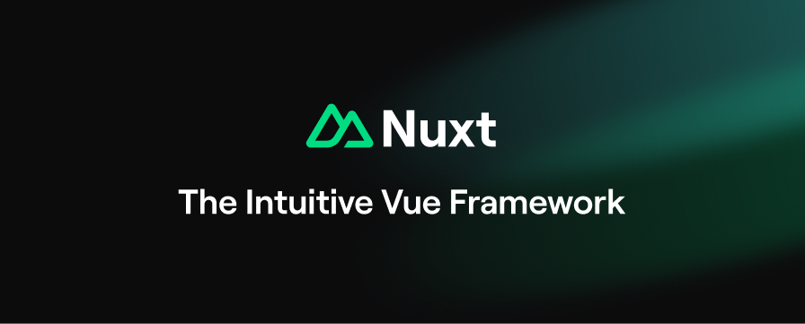
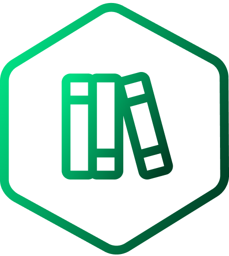
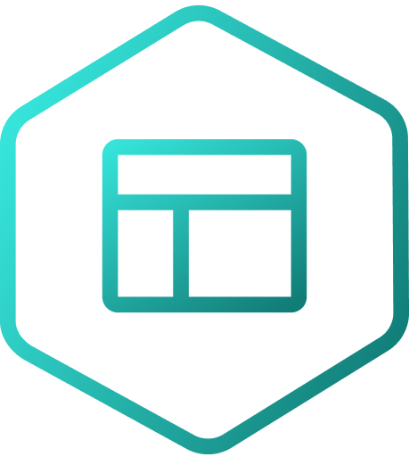
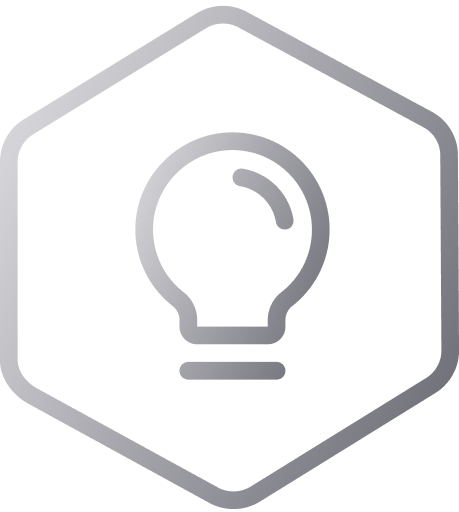

# 👋 Welcome to Nuxt

Nuxt's goal is to make web development intuitive and performant, with a great developer experience. Learn more in the ['What is Nuxt?'](https://nuxt.com/docs/getting-started/introduction) section of our documentation.

 

  
  
  
  
  
 

<table>
<thead>
<tr>
<th width="2000" colspan="2">
</th>
</tr>
</thead>
<tbody>
<tr>
  <td width="80" align="center" valign="top">
     
    
  </td>
  <td valign="top">
    <h3>Documentation</h3>
    

      We highly recommend you take a look at <a href="https://nuxt.com">the Nuxt documentation</a> to level up.
    

  </td>
</tr>
<tr>
  <td width="80" align="center" valign="top">
     
    
  </td>
  <td valign="top">
    <h3>Modules</h3>
    

      Discover our <a href="https://nuxt.com/modules">list of modules</a> to supercharge your Nuxt project. Created by the Nuxt team and community.
    

  </td>
</tr>
<tr>
  <td width="80" align="center" valign="top">
     
    
  </td>
  <td>
    <h3>Examples</h3>
    

      Explore different ways of using Nuxt features and get inspired with <a href="https://nuxt.com/docs/examples/essentials/hello-world">our list of examples</a>.
    

  </td>
</tr>
</tbody>
</table>

<table>
<thead>
<tr>
<th width="2000" colspan="2">
</th>
</tr>
</thead>
<tbody>
<tr>
  <td width="80" align="center" valign="top">
     
    
  </td>
  <td valign="top">
    <h3>Reporting bugs</h3>
    

      Check out the <a href="https://nuxt.com/docs/community/reporting-bugs">Reporting Bugs</a> page.

    

  </td>
</tr>
<tr>
  <td width="80" align="center" valign="top">
     
    
  </td>
  <td valign="top">
    <h3>Suggestions</h3>
    

      Check out the <a href="https://nuxt.com/docs/community/contribution">Contribution</a> page.
    

  </td>
</tr>
<tr>
  <td width="80" align="center" valign="top">
     
    
  </td>
  <td valign="top">
    <h3>Questions</h3>
    

      Check out the <a href="https://nuxt.com/docs/community/getting-help">Getting Help</a> page.
    

  </td>
</tr>
</tbody>
</table>

## Local Development

Follow the docs to [Set Up Your Local Development Environment](https://nuxt.com/docs/community/framework-contribution#set-up-your-local-development-environment) to contribute to the framework and documentation.

## Nuxt 2

You can find the code for Nuxt 2 on the [`2.x` branch](https://github.com/nuxt/nuxt/tree/2.x) and the documentation at [v2.nuxt.com](https://v2.nuxt.com).

## Follow us

  &nbsp;&nbsp;&nbsp;&nbsp;

## License

[MIT](./LICENSE)

