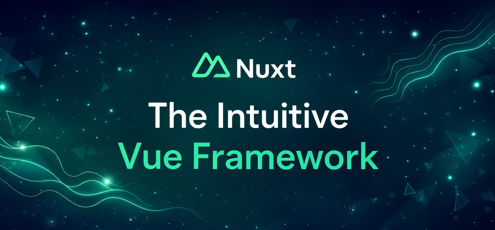

<p align="center">
<a href="https://nuxt.com"></a>

</p>

<p align="center">
  <em>The Intuitive Vue Framework</em>
</p>

<p align="center">
  <a href="https://npmx.dev/package/nuxt"></a>
  <a href="https://npmx.dev/package/nuxt"></a>
  <a href="https://github.com/nuxt/nuxt/blob/main/LICENSE"></a>
  <a href="https://nuxt.com/modules"></a>
  <a href="https://nuxt.com"></a>
  <a href="https://chat.nuxt.dev"></a>
  <a href="https://securityscorecards.dev/viewer/?uri=github.com/nuxt/nuxt"></a>
  <a href="https://deepwiki.com/nuxt/nuxt"></a>
</p>

<p align="center">
  Nuxt is a <strong>free and open-source</strong> framework to build <strong>type-safe</strong>, <strong>performant</strong> and <strong>production-grade</strong> full-stack web applications on <strong>Vue.js</strong>.
</p>

---

## Quick Start

```bash
npx nuxi@latest init my-app       # npm
pnpm dlx nuxi@latest init my-app  # pnpm
bunx nuxi@latest init my-app      # bun
```

> [!TIP]
> **[nuxt.new](https://nuxt.new)** — open a starter instantly on CodeSandbox, StackBlitz, or locally. No setup needed.

<br>

## Features

<table>
<tr>
<td width="33%" valign="top">

### Hybrid Rendering

SSR, SSG, ISR, SWR, Edge-Side and client-side — mix per route.

</td>
<td width="33%" valign="top">

### Auto-Imports

Components, composables and utils — available everywhere, no imports needed.

</td>
<td width="33%" valign="top">

### File-Based Routing

Drop a `.vue` file in `pages/` and it becomes a route with code-splitting.

</td>
</tr>
<tr>
<td width="33%" valign="top">

### TypeScript

Zero-config with auto-generated types across your entire app.

</td>
<td width="33%" valign="top">

### Full-Stack

API routes in `server/` powered by [Nitro](https://nitro.build). Type-safe from client to server.

</td>
<td width="33%" valign="top">

### SEO & Meta

Head management, sitemap generation, and SEO utilities — built in.

</td>
</tr>
<tr>
<td width="33%" valign="top">

### Data Fetching

`useFetch` and `useAsyncData` with SSR support, caching, and deduplication.

</td>
<td width="33%" valign="top">

### 300+ Modules

Auth, CMS, database, analytics — one config line. [Explore them all.](https://nuxt.com/modules)

</td>
<td width="33%" valign="top">

### State Management

`useState` for SSR-friendly shared state. Or use [Pinia](https://nuxt.com/modules/pinia) for complex state.

</td>
</tr>
</table>

<br>

## Full-Stack in Action

**`app/pages/index.vue`**

```vue
<script setup lang="ts">
const { data: posts } = await useFetch('/api/posts')
</script>

<template>
  <div>
    <h1>Blog</h1>
    <article
      v-for="post in posts"
      :key="post.id"
    >
      <h2>{{ post.title }}</h2>
    </article>
  </div>
</template>
```

**`server/api/posts.ts`**

```ts
export default defineEventHandler(() => {
  return [
    { id: 1, title: 'Hello Nuxt' },
    { id: 2, title: 'Full-Stack Vue' },
  ]
})
```

Type-safe from server to client — no manual type definitions needed.

<br>

## Deploy Everywhere

<p align="center">
  Powered by <a href="https://nitro.build">Nitro</a> — zero configuration, every platform.
</p>

<p align="center">
  <a href="https://nuxt.com/deploy/vercel"></a>&nbsp;&nbsp;&nbsp;&nbsp;
  <a href="https://nuxt.com/deploy/netlify"></a>&nbsp;&nbsp;&nbsp;&nbsp;
  <a href="https://nuxt.com/deploy/cloudflare"></a>&nbsp;&nbsp;&nbsp;&nbsp;
  <a href="https://nuxt.com/deploy"></a>&nbsp;&nbsp;&nbsp;&nbsp;
  <a href="https://nuxt.com/deploy"></a>&nbsp;&nbsp;&nbsp;&nbsp;
  <a href="https://nuxt.com/deploy"></a>&nbsp;&nbsp;&nbsp;&nbsp;
  <a href="https://nuxt.com/deploy"></a>&nbsp;&nbsp;&nbsp;&nbsp;
  <a href="https://nuxt.com/deploy"></a>&nbsp;&nbsp;&nbsp;&nbsp;
  <a href="https://nuxt.com/deploy"></a>&nbsp;&nbsp;&nbsp;&nbsp;
  <a href="https://nuxt.com/deploy"></a>&nbsp;&nbsp;&nbsp;&nbsp;
  <a href="https://nuxt.com/deploy"></a>&nbsp;&nbsp;&nbsp;&nbsp;
  <a href="https://nuxt.com/deploy"></a>
</p>

<p align="center">
  <strong>Static hosting</strong>, <strong>serverless</strong>, <strong>edge workers</strong>, <strong>Node.js</strong> — Nuxt adapts to your infrastructure.<br><br>
  <a href="https://nuxt.com/deploy"></a>
</p>

<br>

## Ecosystem

<table>
<tr>
<td width="50%" valign="top">

### &nbsp; [Nuxt UI](https://ui.nuxt.com)

**100+ production-ready components** built on Reka UI and Tailwind CSS. Fully **open source** with a free Figma Kit. Build dashboards, landing pages, and SaaS products without starting from scratch.

</td>
<td width="50%" valign="top">

### &nbsp; [NuxtHub](https://hub.nuxt.com)

Database, key-value storage, blob storage and caching — all built in. Go full-stack with **zero external services**. One `nuxt.config` line, done.

</td>
</tr>
<tr>
<td width="50%" valign="top">

### &nbsp; [Nuxt Content](https://content.nuxt.com)

File-based CMS powered by **Markdown with embedded Vue components**. Write `<MyComponent />` directly in `.md` files. Query content like a database with the **Collections API**.

</td>
<td width="50%" valign="top">

### &nbsp; [Nuxt DevTools](https://devtools.nuxt.com)

Inspect routes, components, state, data fetching and performance — **directly in your browser**. See exactly what your app is doing without leaving the page.

</td>
</tr>
<tr>
<td width="50%" valign="top">

### &nbsp; [Nitro](https://nitro.build)

The **universal server engine** behind Nuxt. Auto-optimized builds for every platform. API routes, server middleware, and tasks — all with **full TypeScript** support.

</td>
<td width="50%" valign="top">

### &nbsp; [Nuxt Layers](https://nuxt.com/docs/getting-started/layers)

**Extend and compose** Nuxt applications like building blocks. Share components, composables, pages, and config across projects. The architecture for **large-scale apps**.

</td>
</tr>
</table>

<p align="center">
  <a href="https://nuxt.com/modules"></a>
</p>

<br>

## Documentation

The [Nuxt documentation](https://nuxt.com/docs) covers everything from getting started to advanced topics.

Nuxt is also built for the AI era — use the [**Nuxt MCP server**](https://nuxt.com/docs/4.x/guide/ai/mcp) to give your AI assistant real-time access to the docs, or point it at [**`llms.txt`**](https://nuxt.com/docs/4.x/guide/ai/llms-txt) for full context in a single file.

<p align="center">
  <a href="https://nuxt.com/docs"></a>
</p>

<br>

## Contribute

Nuxt is built by people, for people. Every bug report, idea and pull request makes the framework better for everyone.

We invite you to contribute and help improve Nuxt 💚

<table width="100%">
<tr>
<td align="center" width="33%">
  <a href="https://nuxt.com/docs/4.x/community/reporting-bugs">
    <br>
    <b>Reporting Bugs</b>
  </a>
</td>
<td align="center" width="33%">
  <a href="https://nuxt.com/docs/4.x/community/contribution">
    <br>
    <b>Suggestions</b>
  </a>
</td>
<td align="center" width="33%">
  <a href="https://nuxt.com/docs/4.x/community/getting-help">
    <br>
    <b>Questions</b>
  </a>
</td>
</tr>
</table>

<br>

<p align="center">
  <a href="https://github.com/nuxt/nuxt/graphs/contributors"></a>
</p>

<br>

## Local Development

Ready to contribute? Get up and running in under a minute:

```bash
# Fork nuxt/nuxt on GitHub, then:
git clone https://github.com/<your-username>/nuxt.git
cd nuxt
corepack enable
pnpm install --frozen-lockfile
pnpm dev:prepare
```

```bash
pnpm dev          # Start the playground
pnpm test         # Run tests
pnpm lint --fix   # Lint & auto-fix
```

> [!TIP]
> See the full [contribution setup guide](https://nuxt.com/docs/4.x/community/framework-contribution#setup) for more details.

<br>

## Professional Support

- Technical audit & consulting: [Nuxt Experts](https://nuxt.com/enterprise/support)
- Custom development & more: [Nuxt Agency Partners](https://nuxt.com/enterprise/agencies)

<br>

## Follow Us

<p>
  <a href="https://go.nuxt.com/discord"></a>&nbsp;&nbsp;
  <a href="https://go.nuxt.com/x"></a>&nbsp;&nbsp;
  <a href="https://go.nuxt.com/github"></a>&nbsp;&nbsp;
  <a href="https://go.nuxt.com/bluesky"></a>
</p>

## License

[MIT](https://github.com/nuxt/nuxt/blob/main/LICENSE)
