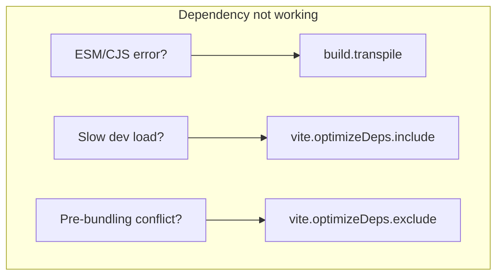

This guide explains Nuxt and Vite internals that matter when adding external dependencies (Vite plugins, local modules) or authoring Nuxt modules.

## Virtual Modules and Alias

### Nuxt virtual modules

Nuxt exposes several virtual or alias-based "modules" resolved at build time:

| Alias / prefix   | Purpose |
|------------------|--------|
| `#build`         | Generated files in `.nuxt` (templates). Use for runtime config or module-generated code. |
| `#imports`       | Auto-imports (composables, utils). Prefer in app code over importing from `#app` when you want tree-shaking. |
| `#components`    | Auto-registered components. Used by the component resolver. |
| `#app`           | Nuxt app runtime (composables, etc.). |
| `virtual:nuxt:*` | Internal VFS resolution; templates are served under this prefix. |

For adding your own generated code, use [`addTemplate`](/docs/4.x/api/kit/templates#addtemplate) so the file lives in the virtual file system and can be imported via `#build/your-file.mjs`.

### When to use addTemplate vs alias

- **addTemplate**: You need a **generated** file (contents depend on config or build). The file is available as `#build/<filename>` and in the VFS as `virtual:nuxt:...`. See [Add Virtual Files](/docs/4.x/guide/modules/recipes-advanced#add-virtual-files) and [Templates](/docs/4.x/api/kit/templates#addtemplate).
- **alias**: You need to **redirect** an import to an existing path (e.g. a different entry of a dependency). Configure in `nuxt.config`:

```ts
export default defineNuxtConfig({
  alias: {
    'my-lib': 'my-lib/dist/esm.js',
  },
})
```

## Transpile, optimizeDeps: include and exclude

When a dependency does not work as expected, use this decision flow:



### build.transpile

Use when a library breaks because of ESM/CJS format (e.g. Node or bundler cannot handle it). Nuxt will transpile matching dependencies.

```ts
export default defineNuxtConfig({
  build: {
    transpile: ['sample-library'],
  },
})
```

You may need to add other packages that are imported by these libraries. See [ES Modules — Transpiling Libraries](/docs/4.x/guide/concepts/esm#transpiling-libraries).

Nuxt automatically adds transpiled dependencies to Vite's `optimizeDeps.exclude` so they are not pre-bundled and stay in the transform pipeline.

### vite.optimizeDeps.include

Use when Vite discovers new dependencies at runtime and you want to pre-bundle them to avoid full page reloads in dev. Add the package name (and subpaths if needed):

```ts
export default defineNuxtConfig({
  vite: {
    optimizeDeps: {
      include: ['cross-fetch', 'my-package/subpath'],
    },
  },
})
```

In modules, prefer extending config inside a Vite plugin with `config` or `configEnvironment` (see [Builder](/docs/4.x/api/kit/builder#extendviteconfig)).

### vite.optimizeDeps.exclude

Use when a dependency must not be pre-bundled (e.g. ESM-only packages that break when pre-bundled). Transpiled dependencies are already excluded by default.

```ts
export default defineNuxtConfig({
  vite: {
    optimizeDeps: {
      exclude: ['vue-demi'],
    },
  },
})
```

## Nuxt imports: transform include/exclude

Auto-imports are applied by a transform that runs on resolved files. You can restrict or extend which files are transformed.

- **imports.transform.include**: Array of `RegExp`. If a file path matches, it is eligible for transform (unless excluded).
- **imports.transform.exclude**: Array of `RegExp`. Matching files are not transformed.

By default, transform runs for files under the build dir and for `.vue` / `.js` (and similar) files. Code inside `node_modules` is only transformed for the `#imports` virtual import, not for full auto-import injection.

Use **include** when you need auto-imports inside code that lives outside the app source (e.g. a Vite plugin that uses Nuxt composables). Use **exclude** to skip transform for specific paths.

```ts
export default defineNuxtConfig({
  imports: {
    transform: {
      include: [/\.vue$/, /\.(js|ts)$/, /node_modules\/my-vite-plugin/],
      exclude: [/node_modules\/some-other-lib/],
    },
  },
})
```

## Nitro event handlers and plugins

Server runtime is powered by [Nitro](https://nitro.build). To extend it:

- **addServerHandler**: Add API routes or middleware. See [Nitro — addServerHandler](/docs/4.x/api/kit/nitro#addserverhandler).
- **addServerPlugin**: Run code once at server startup and hook into Nitro lifecycle. See [Nitro — addServerPlugin](/docs/4.x/api/kit/nitro#addserverplugin).

Nitro plugins receive `nitroApp` and can use [Nitro runtime hooks](https://nitro.build/guide/plugins): `request`, `response`, `error`, `close`. These are **runtime** hooks (per request or on shutdown), unlike Nuxt hooks which are **build-time**.

Example (in a plugin added via `addServerPlugin`):

```ts
import { definePlugin } from 'nitro'

export default definePlugin((nitroApp) => {
  nitroApp.hooks.hook('request', (event) => {
    // runs at the start of each request
  })
  nitroApp.hooks.hook('response', (res, event) => {
    // runs after the response is created
  })
})
```

## Import protection

Nuxt blocks certain imports in runtime code to avoid using build-only or wrong-context code in the app or server.

- **nuxt-app** (Vue app): You cannot import `nuxt`, `nuxt.config`, `@nuxt/kit`, `nitropack`, or server-only paths. Use `#app` / `#imports` for composables and `$fetch` or `useFetch` for API.
- **nitro-app** (server): You cannot import Vue app aliases (`#app`, `#build/...` for app-only templates) or app-only code. Use server utilities and `#server` where intended.
- **shared**: Same as above: no Nuxt/Vite build-time or context-specific imports.

If you see an error like "cannot be imported in server runtime" or "Vue app aliases are not allowed", move the code to the correct layer (app vs server vs shared) or use the suggested alternatives (e.g. `#imports`, `$fetch`) from the error message.

::read-more{to="/docs/4.x/guide/concepts/esm"}
ES Modules and transpiling dependencies.
::

::read-more{to="/docs/4.x/guide/recipes/vite-plugin"}
Using Vite plugins in Nuxt.
::

::read-more{to="/docs/4.x/api/kit/builder"}
Nuxt Kit Builder API (extendViteConfig, addVitePlugin).
::
