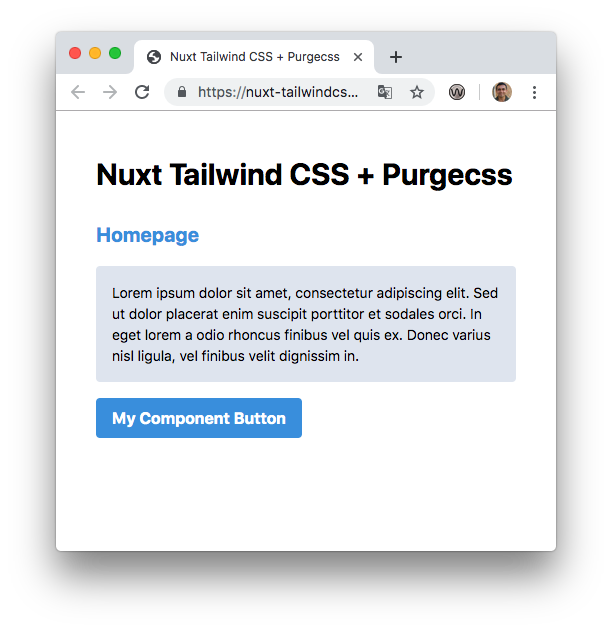
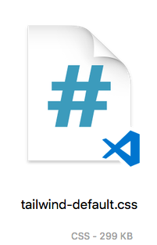
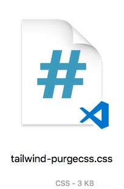

# Nuxt Tailwind CSS + Purgecss

> Demo of using Nuxt with Tailwind CSS and Purgecss to drastically reduce CSS size.

## Demo

[https://nuxt-tailwindcss-purgecss.surge.sh/](https://nuxt-tailwindcss-purgecss.surge.sh/)

### Before and after stats

The before CSS bundle came out to `299kb`, where as after running it through Purgecss, it dropped to `3kb` (granted I'm only using around a dozen classes).

### Performance

And since the CSS remains inline (due to using Purgecss as a postcss plugin) it scores perfect on Google Page Speed Insights! (This is after running `nuxt generate` and deploying the `dist` folder)

### Other

See also this [demo](https://github.com/nuxt/nuxt.js/tree/dev/examples/with-purgecss)
